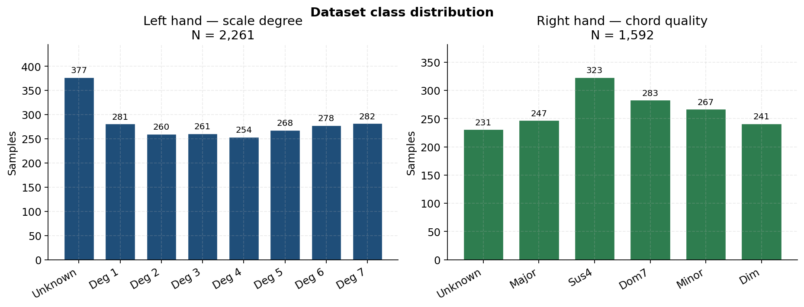
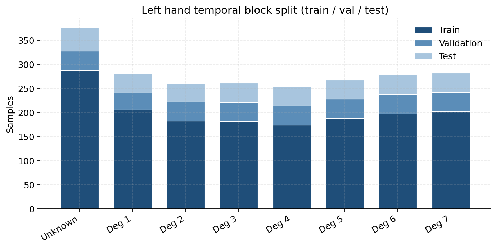
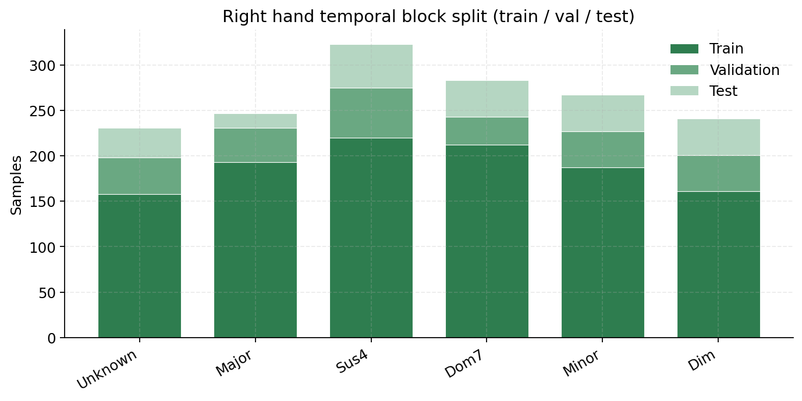
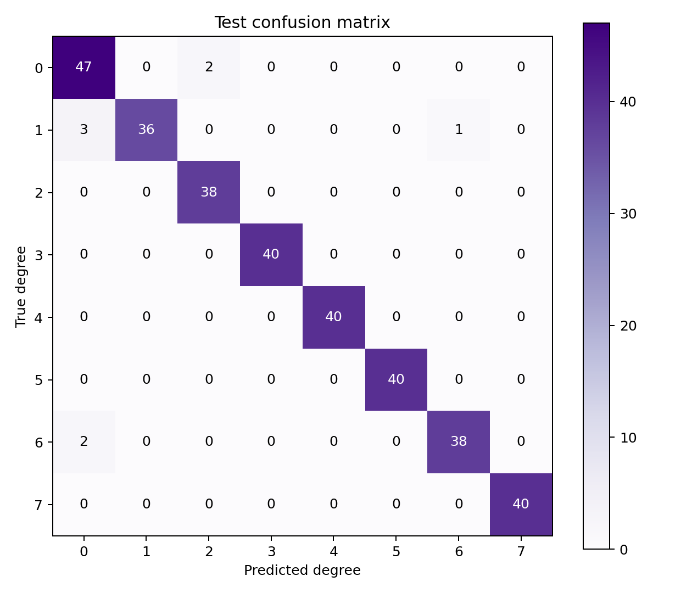
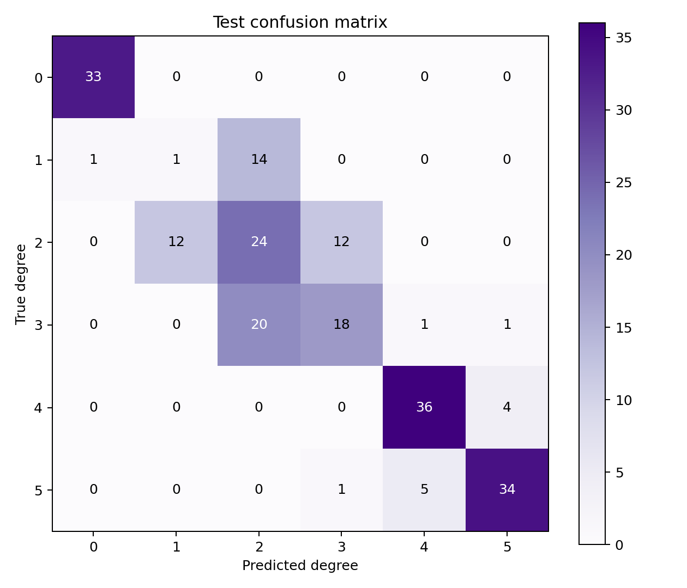
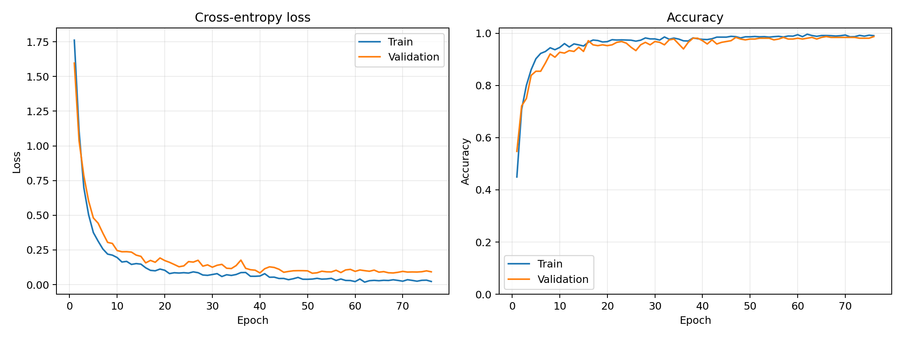
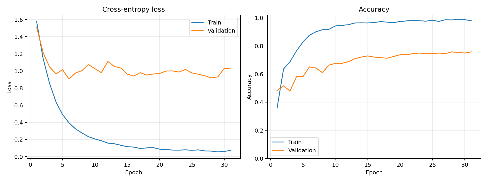
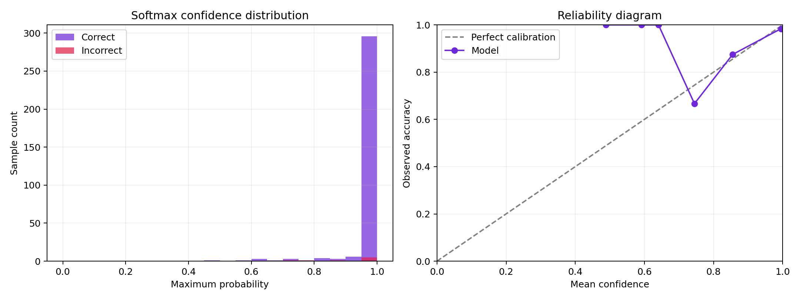
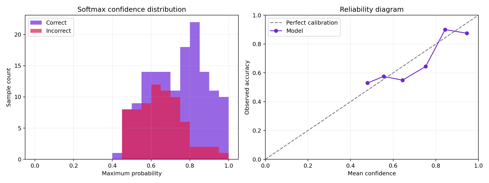

# ChordFlow

Tarayıcıda çalışan gerçek zamanlı gesture synthesizer: kamera → el landmarkları →
çift ONNX MLP sınıflandırıcı → akor / volume / timbre → Web Audio.

---

## Mimari özeti

Tüm inference **client-side** çalışır. Video frame’ler cihazdan çıkmaz; sunucu
yalnızca static Vite build + ONNX model dosyalarını servis eder.

### Browser runtime stack

| Katman | Teknoloji | Rol |
|--------|-----------|-----|
| UI | React 19 + Vite | `/play`, collector, classifier test sayfaları |
| Kamera | `getUserMedia` + `<video>` | Canlı webcam akışı |
| El takibi | **MediaPipe Tasks Vision** (`HandLandmarker`) | Web Worker içinde WASM/GPU; 2 el × 21 landmark × XYZ |
| Sınıflandırma | **ONNX Runtime Web** (`onnxruntime-web/wasm`) | Sol + sağ MLP; ham `63` float → logits |
| Müzik | **Web Audio API** | Triangle / saw / square chord synth, envelope, expression |
| İfade | Landmark geometrisi (NN dışı) | Sağ wrist Y → volume; palm roll → timbre |

```text
┌─────────────────────────────────────────────────────────────────────────┐
│                         BROWSER (tek sekme)                             │
│                                                                         │
│  Webcam ──► Main thread (React)                                         │
│                │                                                        │
│                │ ImageBitmap + timestamp                                │
│                ▼                                                        │
│         ┌──────────────────────┐                                        │
│         │  Web Worker          │  @mediapipe/tasks-vision               │
│         │  HandLandmarker      │  WASM (+ GPU delegate fallback CPU)    │
│         │  hand_landmarker.task│  numHands=2, VIDEO mode                │
│         └──────────┬───────────┘                                        │
│                    │ 21×3 landmarks / hand + handedness                 │
│                    ▼                                                    │
│         ┌──────────────────────┐     ┌──────────────────────┐           │
│         │ LeftHandClassifier   │     │ RightHandClassifier  │           │
│         │ left_hand_model.onnx │     │ right_hand_model.onnx│           │
│         │ ORT WASM · paralel   │     │ ORT WASM · paralel   │           │
│         └──────────┬───────────┘     └──────────┬───────────┘           │
│                    │ 8-class logits             │ 6-class logits        │
│                    ▼                            ▼                       │
│         conf≥0.85 + margin≥0.20        argmax (reject yok)              │
│         temporal vote 2/3 @ 50ms       temporal vote 2/3 @ 50ms         │
│                    │                            │                       │
│                    └──────────┬─────────────────┘                       │
│                               ▼                                         │
│                    resolveGestureChord(tonic, mode, L, R)               │
│                               │                                         │
│         wrist Y ──► volume    │    palm roll ──► osc mix / filter       │
│                               ▼                                         │
│                    SynthEngine (Web Audio)                              │
│                    triangle + saw + square → lowpass → master           │
└─────────────────────────────────────────────────────────────────────────┘
```

### ML pipeline (eğitim → tarayıcı)

Offline eğitim PyTorch ile yapılır; export edilen ONNX, **geometrik
normalizasyon + train mean/std**’yi grafa gömer. Tarayıcı yalnızca ham
landmark tensor’ü (`1×63`) verir.

```text
TRAIN (Python / PyTorch)                    BROWSER (ONNX Runtime Web)
─────────────────────────                   ──────────────────────────
landmarks.csv  (21×3 raw)                   MediaPipe landmarks (21×3)
        │                                           │
        ▼                                           ▼
 geometric normalize                         [embedded in ONNX]
  1. subtract wrist (lm0)                     aynı adımlar:
  2. scale by wrist→middle MCP (lm9)            wrist center
  3. rotate XY so palm points up                palm scale
  4. clip [-4, 4]                               XY rotate + clip
        │                                       train mean/std
        ▼                                           │
 train-only mean / std                          ▼
        │                                   LeftHandMLP / RightHandMLP
        ▼                                           │
 LeftHandMLP                                    logits → softmax
  63 → Linear(128) → BN → ReLU → Dropout            │
     → Linear(64)  → ReLU → Dropout                 ▼
     → Linear(C)                                class + confidence
        │
        ▼
 export BrowserInferenceModel → public/models/*.onnx
```

### Model detayı

Her iki el aynı MLP gövdesini kullanır; fark yalnızca çıktı sınıf sayısıdır.

```text
Input  float32[B, 63]     # 21 landmark × (x,y,z)  — ham veya (train'de) normalize

  Linear(63 → 128)        # PyTorch default: Kaiming uniform (a=√5)
  BatchNorm1d(128)        # affine=True, track_running_stats=True
  ReLU()
  Dropout(p=0.25)

  Linear(128 → 64)        # Kaiming uniform
  ReLU()
  Dropout(p=0.15)         # 0.25 × 0.6

  Linear(64 → C)          # logits; Softmax yok (CrossEntropy içinde)
                          # C=8 sol, C=6 sağ
```

| Konu | Değer |
|------|--------|
| Activation | **ReLU** (gizli katmanlar); çıktıda raw logits |
| Weight init | PyTorch `nn.Linear` default → **Kaiming uniform** (`a=√5`); bias uniform |
| BatchNorm init | γ=1, β=0 (PyTorch default); running mean/var eğitimde güncellenir |
| Custom init | Yok — `nn.Module` default’ları |
| Loss | **Weighted CrossEntropy** — `w_c = N / (C · n_c)` (inverse frequency) |
| Optimizer | **AdamW** — `lr=1e-3`, `weight_decay=1e-4` |
| LR schedule | **ReduceLROnPlateau** — val loss ↓ değilse `factor=0.5`, patience 7, `min_lr=1e-6` |
| Early stop | val loss iyileşmezse **patience=25**; en iyi checkpoint restore |
| Epochs / batch | max 200 / 64 |
| Seed | 42 |
| Augment (train) | Gaussian noise σ=`0.015` (normalize sonrası feature’lara) |
| Split | Temporal blok (size 20, gap 2s) → train 70% / val 15% / test 15% |
| Feature scale | Train-only mean/std; ONNX’e buffer olarak gömülür |

| | Sol el | Sağ el |
|---|--------|--------|
| Girdi | `float32[1, 63]` ham XYZ | aynı |
| Sınıflar `C` | **8** — `0` Unknown + derece `1–7` | **6** — `0` Unknown + tip `1–5` |
| Inference reject | confidence `< 0.85` veya top-2 margin `< 0.20` → kararsız | yok (argmax) |
| Temporal | son 3 inference, **2/3** çoğunluk, throttle **50 ms** | aynı |
| Çıktı anlamı | gam derecesi (kök) | Major / Sus4 / Dom7 / Minor / Dim |

Akor çözümü uygulama katmanındadır: `sol derece + sağ kalite + seçilen tonic/mode`
→ MIDI frekansları. Volume ve timbre classifier’dan bağımsız landmark
ekspresyonudur.

### Dataset

Örnekler MediaPipe Hand Landmarker ile tek cihazdan toplanır; her satır
`landmarks.csv` içinde 21×3 ham koordinat + handedness skoru tutar. Fotoğraflar
repo’ya girmez (yalnızca lokal eğitim için).

| Dataset | Örnek | Sınıf | Ortalama handedness | Kaynak run |
|---------|------:|------:|--------------------:|------------|
| Sol el | **2 261** | 8 (Unknown + derece 1–7) | 0.978 | `run_20260729_193928` |
| Sağ el | **1 592** | 6 (Unknown + tip 1–5) | 0.981 | `run_20260729_205333` |

Sınıf dengesine yaklaşmak için loss’ta inverse-frequency class weight kullanılır.
Bitişik kamera karelerinin train/test’e sızmasını azaltmak için her sınıf zaman
sırasında **temporal blok**lara (size 20, gap 2 s) ayrılır; bloklar
≈70 / 15 / 15 train–val–test dağıtılır.







> **Not:** Kişi / session metadata’sı olmadığı için split kişi-bağımsız
> genellemeyi garanti etmez; held-out kullanıcılarla ek değerlendirme gerekir.

### Deneysel sonuçlar

Ship edilen ONNX modelleri yukarıdaki run’lardan export edilmiştir. Metrikler
**test split** üzerindedir (temporal blok hold-out).

| Model | Best epoch | Test acc. | Macro-F1 | Test N |
|-------|----------:|----------:|---------:|-------:|
| Sol el MLP | 51 | **97.6 %** | **0.977** | 327 |
| Sağ el MLP | 6 | 67.3 % | 0.625 | 217 |

**Sol el — sınıf bazlı F1 (test)**

| Sınıf | Precision | Recall | F1 | Support |
|-------|----------:|-------:|---:|--------:|
| Unknown | 0.90 | 0.96 | 0.93 | 49 |
| Degree 1 | 1.00 | 0.90 | 0.95 | 40 |
| Degree 2 | 0.95 | 1.00 | 0.97 | 38 |
| Degree 3–5, 7 | 1.00 | 1.00 | 1.00 | 40 each |
| Degree 6 | 0.97 | 0.95 | 0.96 | 40 |

**Sağ el — sınıf bazlı F1 (test)**

| Sınıf | Precision | Recall | F1 | Support |
|-------|----------:|-------:|---:|--------:|
| Unknown | 0.97 | 1.00 | 0.99 | 33 |
| Major (1) | 0.08 | 0.06 | 0.07 | 16 |
| Sus4 (2) | 0.41 | 0.50 | 0.45 | 48 |
| Dom7 (3) | 0.58 | 0.45 | 0.51 | 40 |
| Minor (4) | 0.86 | 0.90 | 0.88 | 40 |
| Dim (5) | 0.87 | 0.85 | 0.86 | 40 |

Sağ elde Major / Sus4 / Dom7 ayrımı test setinde zayıf kalır; canlıda temporal
çoğunluk (2/3) ve gesture UX bunu kısmen yumuşatır. Sol elde confidence ≥ 0.85
ve margin ≥ 0.20 reject kuralı ek güvenlik sağlar.













Grafikleri yeniden üretmek için (lokal `landmarks.csv` + training_outputs gerekir):

```bash
python model/generate_readme_figures.py
```

---

## Çalıştırma

```bash
npm install
npm run dev
```

- Ana uygulama: `http://localhost:5173/`
- Sol el dataset aracı: `http://localhost:5173/collect`
- Sağ el dataset aracı: `http://localhost:5173/collect/right`
- Sol el realtime classifier testi: `http://localhost:5173/classify`
- Sağ el realtime classifier testi: `http://localhost:5173/classify/right`
- İki el gesture synth: `http://localhost:5173/play`

### Docker (prod)

```bash
docker compose up --build
# veya
docker build -t chordflow . && docker run --rm -p 8080:80 chordflow
```

Açık adres: `http://localhost:8080/play`

Branch’ler: `main` = prod, `develop` = dev. Dataset fotoğrafları ve `landmarks.csv` git’e dahil edilmez; final ONNX modelleri `public/models/` altındadır.

## Dataset toplama

1. `/collect` sayfasını aç.
2. Kamerayı başlat ve sol elin algılandığını kontrol et.
3. Dropdown veya klavyedeki `0–7` tuşlarıyla sınıfı seç (`0 = Unknown`).
4. `Space` ile tek örnek ya da toplu kayıt düğmesiyle 10, 25 veya 50 örnek kaydet.

Her örnek aynı UUID ile ilişkilendirilir:

```text
model/data/left/
├── 0/{uuid}.jpg
├── 1/{uuid}.jpg
├── 2/{uuid}.jpg
├── ...
├── 6/{uuid}.jpg
├── 7/{uuid}.jpg
└── landmarks.csv
```

`landmarks.csv`; UUID, sınıf, fotoğraf yolu, kayıt zamanı, handedness skoru ve 21 landmark için ham `x`, `y`, `z` koordinatlarını içerir. Sınıf `0`, modelin explicit `Unknown` etiketidir.

Dataset yazma API'si yalnızca yerel Vite geliştirme sunucusunda çalışır.

Sağ el collector aynı kayıt akışını `Unknown (0) + Class 1–5` için kullanır:

```text
model/data/right/
├── 0/{uuid}.jpg
├── 1/{uuid}.jpg
├── ...
├── 5/{uuid}.jpg
└── landmarks.csv
```

Sağ el sınıfları akor adlarına bağlı değildir; uygulama katmanı daha sonra
`Class 1–5` çıktılarını istenen akor tiplerine dinamik olarak eşler.

## Sol el modelini eğitme

Jupyter ile adım adım çalıştırmak için:

```bash
jupyter lab model/left_hand_model_training.ipynb
```

Notebook hücrelerini yukarıdan aşağıya çalıştır.

Komut satırından otomatik eğitim için:

```bash
pip install -r model/requirements-training.txt
python model/left_hand_model_training.py
```

Script; landmarkları bileğe göre merkezler, avuç boyutuyla ölçekler, el
rotasyonunu normalize eder ve yalnızca train verisinden hesaplanan mean/std ile
standardize eder. Ardışık kamera karelerinin splitler arasında sızmasını
azaltmak için temporal blok tabanlı train/validation/test ayrımı kullanır.

Her eğitim çalıştırması ayrı bir klasöre kaydedilir:

```text
model/training_outputs/left_hand/run_<timestamp>/
├── left_hand_model.pt
├── left_hand_model_torchscript.pt
├── preprocessing.npz
├── metrics.json
├── classification_report.csv
├── confidence_thresholds.csv
├── training_history.png
├── confusion_matrix.png
└── confidence_analysis.png
```

Sağ el modeli aynı pipeline ile `Unknown (0) + Class 1–5` olarak eğitilir:

```bash
jupyter lab model/right_hand_model_training.ipynb
# veya
python model/right_hand_model_training.py
```

Çıktılar `model/training_outputs/right_hand/run_<timestamp>/` altında tutulur.

## Realtime ONNX classifier

En güncel notebook/script checkpointini tarayıcı modeline dönüştür:

```bash
python model/export_left_hand_onnx.py
python model/verify_left_hand_onnx.py
```

Sağ el modelini export ve verify etmek için:

```bash
python model/export_left_hand_onnx.py --hand right
python model/verify_left_hand_onnx.py --hand right
```

Ardından Vite sunucusu açıkken `http://localhost:5173/classify` adresine git.
Sayfa MediaPipe sol el landmarklarını ONNX Runtime Web'e verir ve Unknown +
1–7 sınıflarının olasılıklarını canlı gösterir. Class `0` explicit Unknown
sonucudur; confidence `%85` veya ilk iki sınıf arasındaki margin `%20` altında
kaldığında sonuç ayrıca `kararsız` olarak reddedilir.

Sağ el testi `/classify/right` adresindedir. Sağ el argmax sınıfı confidence
reddi olmadan son 3 frame içindeki `2/3` çoğunluk filtresine girer.

## Gesture Synth

`/play` tek kamera akışını iki ONNX classifier'a verir. Sol el `1–7`, seçilen
tonalitenin akor kök derecesini belirler. Sağ el sınıfları:

```text
1 → Major
2 → Sus4
3 → Dominant 7
4 → Minor
5 → Diminished
```

Frontend'den 12 tonal kökten biri ve `Major/Minor` gam seçilir. Sayfa açılınca
kamera ve ses otomatik başlar; her iki elin sonucu temporal `2/3` çoğunluk
filtresinden geçtiğinde Web Audio synth akoru çalar.
Unknown, kararsız sonuç, el kaybı, kamera durması veya sekmenin gizlenmesi sesi
yumuşak release ile kapatır.

Sağ el wrist `Y` koordinatı classifier'dan bağımsız olarak expression volume
kontrol eder: `Y=0` maksimum, `Y=1` minimum sestir. EMA smoothing ve deadband
küçük landmark titreşimlerinin ses seviyesini bozmasını engeller.
